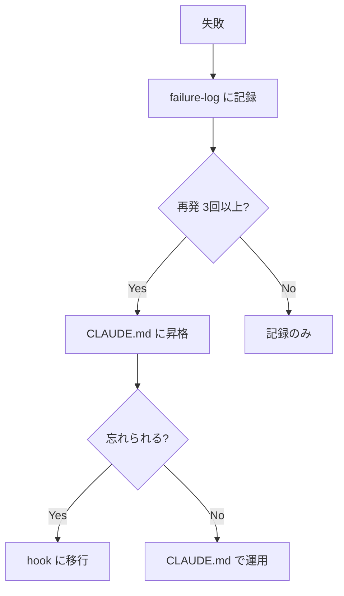
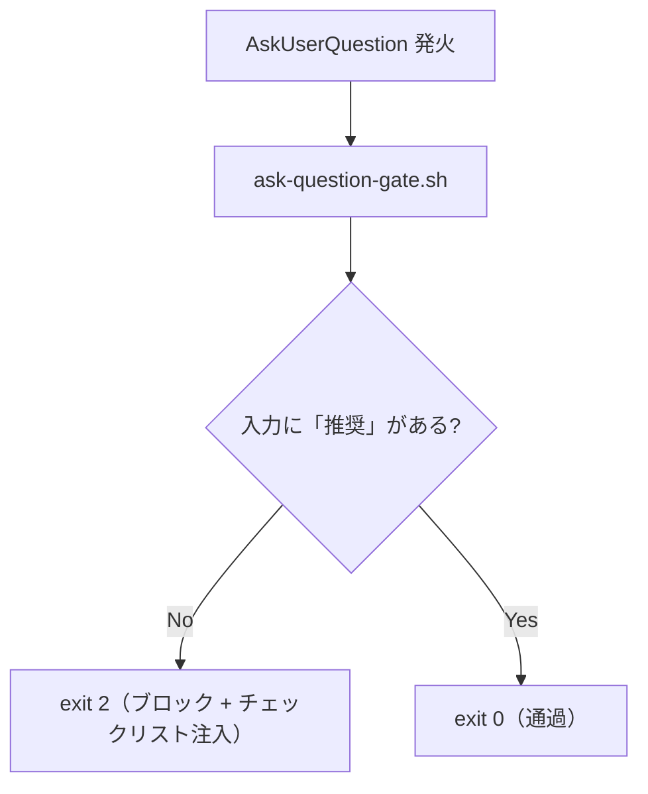
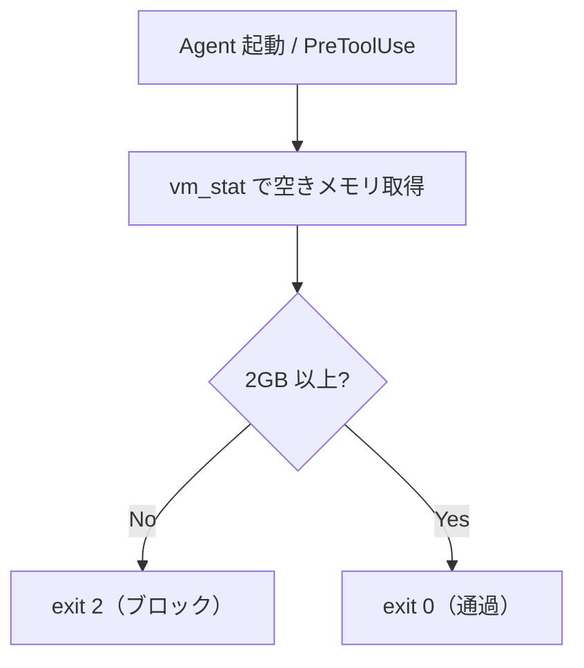

Claude Code に「推測で断言しない」と書いた。CLAUDE.md の三行目あたりに、かなり早い段階で書いた。書いた直後のセッションでは守られていたのだが、翌日、別のセッションで AWS のサービスについて聞いたら、CodeCommit が2024年7月に新規利用終了したと断言してきた（実際には2025年11月に復活している）。指摘すると「すみません、確認すべきでした」と返ってくるのだが、すみませんじゃないんだよ、CLAUDE.md に書いてあるだろ、と思いつつ、まあエージェントに怒っても仕方がないので、ルールの文言をもう少し具体的に書き直した。「ツールの機能・制約」「仕様名」「手順」は先に公式ドキュメントで確認すること、と。数日後、また別のセッションで、今度は Terraform の `untaint` コマンドを平然と提案してきて、こちらは v0.15.2 で非推奨になっているやつだった。CLAUDE.md に書いてあることを、忘れる。

失敗するたびにルールを書き直した。ルールを書き直しても忘れられたら、もっと具体的に書き直した。それでも忘れられるルールは hooks で強制するようにした。そうやっていたら4ヶ月が経っていて、CLAUDE.md は280行になり、ナレッジ用の Git リポジトリ（VS Code と Zed で開いている、普通のリポジトリだ、Obsidian は使っていない）にファイルが100以上、カスタムスキルは40個を超えていた。

最初から名前はなかった。セカンドブレインを作ろうと思ったわけでもないし、ハーネスエンジニアリングという言葉も知らなかった。ただセッションのたびに「何がうまくいって何がうまくいかなかったか」を記録して、次に同じ失敗をしないように環境を直す、ということをやっていただけだ。

## failure-log — 失敗を記録して環境を直す

最初にやったのは `failure-log.md` というファイルを作ることだった。失敗が起きるたびに日付と症状と原因と対策を記録し、対策の配置先（CLAUDE.md に書くのかスキルにするのか hook にするのか）と採否を埋める。

```markdown
| 日付 | 症状 | 原因 | 対策 | 配置先 | 採否 | 再発 |
|------|------|------|------|--------|------|------|
| 06-02 | shell heredoc で特殊文字が壊れた | shell 経由で生成 | Write ツールで書く | CLAUDE.md | 採用 | 3+ |
| 06-02 | 回帰テストを作ったが CI に繋がず無効 | 「作る」と「繋ぐ」を別工程と意識せず | 同 PR で CI への接続を確認 | CLAUDE.md | 採用 | 1 |
| 06-19 | bot レビューの「スコープ外」をそのまま採用 | 事実述べを判断と混同 | コスト比較を自分でやる | CLAUDE.md | 採用 | 2 |
```

最後のカラムが「再発」で、これは後から追加した。同じパターンが3回以上再発したら CLAUDE.md のルールに昇格させるというルールにした。

4ヶ月で failure-log は30件を超えて、そのうち15件が CLAUDE.md のルールになっている。shell の heredoc で特殊文字のエスケープが3回壊れたので Write ツールで書けというルールができ、bot レビューの「スコープ外」を鵜呑みにして2回指摘されたので自分でコスト比較しろというルールができた。



反省文を書いているのではなくて、CLAUDE.md を物理的に書き換えている。

## hooks — 書いても忘れるなら強制する

failure-log を運用していて最も効果があったのは、ルールを CLAUDE.md から hook に移すという判断だった。CLAUDE.md に書いたルールは忘れられる。hooks は忘れられない。

### 質問前ゲート

Claude Code はユーザーに質問を投げるとき、調査もせずに選択肢を並べることがあって、「A と B のどちらがいいですか？」と推奨も根拠もなく聞いてくる。CLAUDE.md に「質問する前に調査し、推奨を添えること」と書いたのだが、最初は守られて1週間で忘れた。そこで `ask-question-gate.sh` という PreToolUse hook を作った。



単純な文字列マッチなのだが、これで質問の質が劇的に変わった。hook は bypass できない。

### メモリ制約ガード

16GB RAM の MacBook で開発していて（個人開発なのでこれが精一杯だ）、`pnpm install` とか `tsc` とか `jest` とかの重いコマンドを並列で走らせると swap が飽和する。実際に一度、3つの worktree で3つのエージェントを並列で動かしたら 68GB の swap を食って PC が強制再起動になったので、それ以来 Agent の PreToolUse hook で `vm_stat` を叩いて空きメモリが 2GB を切ったらエージェントの起動をブロックするようにしている。



ハードウェアの物理制約を harness に埋め込んだ形だ。

### hook の使い分け

| hook | 種類 | やること |
|---|---|---|
| `ask-question-gate.sh` | PreToolUse | 推奨のない質問をブロック |
| メモリ制約ガード | PreToolUse | 空きメモリ不足でエージェント起動をブロック |
| PostToolUse lint | PostToolUse | 書いた後に lint を走らせ `exit 2` で修正を強制 |

## Why 行 — ルールが矛盾したときの判断基準

CLAUDE.md にルールが増えてくると——280行もあるのだから当然なのだが——ルール同士が矛盾するケースが出てくる。「設計は承認を得てから実装する」と書いてあるのに「バグ修正は即座に直す」とも書いてあって、設計変更を伴うバグ修正をどうするのかがルールからは判断できない。

そこですべてのルールに `**Why:**` を付けることにした。

```markdown
### Brainstorming Gate

非自明な実装タスクでは、コードを書く前に設計を提示してユーザー承認を得る。

承認不要: バグ修正（原因が明白）、typo、設定値変更、1ファイル10行以下。

**Why:** エージェントの飛びつき実装による手戻りを防ぐ。
```

Why があるとエッジケースでエージェントが自分で判断できる。10行の変更だけど設計変更を含む場合——Why を読めば「飛びつき実装の防止」が目的だとわかるから、承認を取るべきだと判断できる。正直、完全な解決策ではないと思っているが、280行の CLAUDE.md でルール間の矛盾が起きたとき、Why がなければもっとひどいことになっていた。

## Codex への委譲 — コードは別のモデルに振る

Claude Code はコードを書けるが、コードを書くことに Claude の利用枠を使うのはもったいない。Claude Code には Codex CLI をプラグインとして組み込める仕組みがあって、コードの読み書きが中心のタスク——コードレビュー、バグ修正、リファクタ、テスト追加——は Codex に委譲し、Claude は設計相談やドキュメント執筆やプランニングに専念する、という使い分けをしている。

CLAUDE.md にタスク種別ごとの委譲先を書いてある。

| タスク種別 | Claude | Codex |
|---|---|---|
| 計画・設計・リファクタ設計 | ◯ | — |
| コードレビュー・品質チェック | — | ◯ |
| バグ修正・実装 | — | ◯ |
| ドキュメント・小説執筆 | ◯ | — |
| git 操作・環境構築 | ◯ | — |

さらに `delegation-mode` というファイルで委譲の強度を切り替えている。`max`（Max プラン用）では標準的なルールで委譲し、`pro`（Pro プラン用）ではコード系に加えて長文解析や繰り返しの grep/read まで Codex に投げて、Claude は統合判断と Web 検索と最終整形だけを担当する。プランを変えたときにファイルを1つ書き換えるだけで委譲戦略が切り替わる。

## Dynamic Workflows — $200 溶かして学んだコスト制御

Claude Code には Dynamic Workflows（Ultracode）という機能があって、複数のエージェントを並列で fan-out して走らせることができる。これ自体は強力なのだが、一度やらかした。

2026年6月1日、Ultracode でセキュリティ調査を走らせたところ、5時間の利用枠リミットと組織の Extra Usage（$200）を一晩で使い切った。原因は並列で走る全エージェントが親セッションのモデル（Opus）と effort（xhigh）を継承していたこと。探索や要約をするだけのエージェントにも Opus の xhigh が割り当てられていて、それが並列で10個以上走った。

並列を殺すと Workflows の価値がなくなるので、代わりに stage ごとにモデルを振り分けるルールを作った。

```javascript
// 探索・抽出 → haiku（安い）
await agent('ソースを検索', { model: 'haiku', phase: 'Search' })

// レビュー・検証 → sonnet（中間）
await agent('実装をレビュー', { model: 'sonnet', phase: 'Review' })

// 設計判断 → opus（高い・少数のみ）
await agent('最終判断を統合', { model: 'opus', phase: 'Synthesize' })
```

さらに、Review フェーズでは Codex プラグインのエージェントを並走させることもできる。Claude（sonnet）と Codex が同じコードを別々にレビューして、多角的にチェックする構成だ。Codex のエージェントは Claude の利用枠を消費しないので、コスト的にも理にかなっている。

```javascript
await parallel([
  () => agent('Claude でレビュー', { model: 'sonnet', phase: 'Review' }),
  () => agent('Codex でレビュー', { agentType: 'codex:codex-rescue', phase: 'Review' }),
])
```

Workflow の起動前には必ず「総エージェント数・最大並列数・各 stage のモデル・コストが大きい step・停止条件」を提示するルールも CLAUDE.md に入れた。$200 の授業料は高かったが、このルールのおかげで以降は同じ事故が起きていない。

## Review Loop — push 前に全部直す

コード変更を push する前に、Codex（`--effort high`）か Claude の Opus サブエージェントで事前レビューを実施して、指摘を全件修正してから push するようにしている。

これを始めた理由は単純で、CI bot のレビューで何度もラウンドトリップした経験があったからだ。ある PR で6ラウンド、別の PR で15ラウンド。push してから bot に指摘されて直して push して、また指摘されて直して push して、という繰り返しが地味にだるかったし、CI の実行時間も無駄だった。push 前に手元でレビューを回せば、CI bot で残る指摘は「本当に気づけなかった点」だけになる。

レビューの観点は Böckeler の3カテゴリに沿って整理している。

| カテゴリ | 観点 | 手段 |
|---|---|---|
| **Maintainability** | コード品質・内部標準 | lint / typecheck / test |
| **Architecture Fitness** | 性能・依存関係・構造制約 | ベンチマーク / dep-cruiser |
| **Behaviour** | 機能的正確性 | 既存テストとの整合・エッジケース確認 |

Böckeler は Behaviour（機能的正確性）のハーネスが最も未成熟だと書いていて[^2]、「AI 生成テストだけに頼るのはまだ不十分」と指摘している。実際そうだと思う。AI が書いたテストは AI が書いたコードを通すように作られるので、既存テストとの整合やエッジケースの手動確認は省略できない。

## プラグインとスキルの組み合わせ

Claude Code にはプラグインやスキルでツールを追加できる仕組みがあって、前述の Codex 委譲もその一つだが、他にもいくつか組み合わせている。Mermaid Chart でダイアグラムを描いたり、Zenn CLI で記事のプレビューを確認したり、Typst でドキュメントを組版したり。40個を超えたカスタムスキルには、セッションの振り返りをする `/session-retro`、ナレッジを Obsidian Vault に保存する `/save-knowledge`、Vault の過去ノートで自分の判断に反論する `/vault-challenge` などがある。

スキルが増えてくると、CLAUDE.md に「このスキルをいつ使うか」の対応表を書いておくのが効果的で、ユーザーがスキル名を言わなくてもタスクの種類から自動的にスキルを選ぶようになる。

| ユーザーの言葉・状況 | 呼び出すスキル |
|---|---|
| バグ・エラーを調査している | `/diagnose` |
| テストを書きたい | `/tdd` |
| 判断の穴を探したい | `/vault-challenge` |
| ナレッジを保存したい | `/save-knowledge` |
| Zenn に記事を書きたい | `/publish-zenn` |

これも結局は CLAUDE.md に書いてあるルールなので Inferential ではあるのだが、スキルの呼び出し自体は成功率が高い。ルールの複雑さが低い（「このキーワードが出たらこのスキルを使え」というシンプルなマッチング）ので、忘れられにくいのだと思う。

## やっていたことに名前がついた

ここまで書いてきたことを、私は特に何かの方法論に従ってやっていたわけではない。失敗を記録して環境を直す、忘れられるルールは hooks で強制する、ルールには理由を書く。それだけだ。

後から知ったのだが、Mitchell Hashimoto（HashiCorp の創業者で、最近は Ghostty というターミナルエミュレータを作っている）が同じことをやっていた[^1]。Ghostty の開発で AI エージェントが失敗するたびに AGENTS.md にルールを追加していく。モデルを責めるのではなく環境を直す。これが後に **Ratchet Pattern** と呼ばれるようになった考え方だ。ラチェットレンチ——一方向にしか回らない工具。品質は上がるだけで下がらない。私の failure-log はまさにこれだった。

[^1]: [My AI Adoption Journey](https://mitchellh.com/writing/my-ai-adoption-journey), Mitchell Hashimoto, 2026-02

2026年4月に Birgitta Böckeler という Thoughtworks のエンジニアが Martin Fowler のサイトにかなり整理された記事[^2]を書いていて、ここで **Agent = Model + Harness** という定式が出てくる。モデル以外のすべてが harness だ、と。で、この記事を読んでいて一番腑に落ちたのが、Computational と Inferential の区別だった。

[^2]: [Harness Engineering for Coding Agent Users](https://martinfowler.com/articles/harness-engineering.html), Birgitta Böckeler, 2026-04

| | 予防（Feedforward） | 検証（Feedback） |
|---|---|---|
| **Computational**（決定論的） | OpenRewrite recipes | lint、テスト |
| **Inferential**（推論的） | CLAUDE.md のルール | AI レビュー |

CLAUDE.md にルールを書くのは Inferential Feedforward で、モデルが読んで理解して従うことを期待している推論的な予防策にすぎない。一方で hooks は Computational であり、`exit 2` を返せばツールの実行がブロックされて、モデルの気分は関係ない。「CLAUDE.md のルールが忘れられるのはバグではなく設計上の限界だ」——これを読んだときに、自分がやっていたことの理由がわかった。私は直感的に CLAUDE.md の限界を感じて hooks に移していたのだが、それは Inferential から Computational への移行だったのだ。

Böckeler は「ハーネスが大きくなったとき、ガイドとセンサーの一貫性をどう保つか」を未解決課題として挙げていて[^2]、Why 行は私なりのその問題への暫定的な回答だった。

## 他の人はどうしているのか

自分がやっていることに名前がついたので、他の人がどうしているのか気になって調べた。Claude Code の harness を高度に組んでいるプロジェクトは英語圏に少なくとも2つあった。

| | obsidian-second-brain | ECC | 私の環境 |
|---|---|---|---|
| 方向性 | ナレッジの自動進化 | スケール・セキュリティ | 制約駆動 |
| 規模 | 45コマンド | 271スキル / 67エージェント | 40スキル |
| 特徴 | 自己書き換え Vault、bi-temporal facts | AgentShield (red-team)、instinct scoring | failure-log → 昇格、hooks 強制、Why 行 |
| 思想 | Vault が自分で賢くなる | チームで使える汎用基盤 | 守らないと進めない |

[obsidian-second-brain](https://github.com/eugeniughelbur/obsidian-second-brain) で面白いのは Vault が自己書き換えをするところで、情報を取り込むと既存のページを追記ではなく再構成する。bi-temporal facts という仕組みもあって「いつ事実だったか」と「いつ Vault がそれを学んだか」を分離して追跡しているし、`/obsidian-challenge` というコマンドは Vault の過去のノートを使って自分の現在の判断に反論してくれる。これは素直にいいなと思って、似たようなスキルを自分の環境にも作った。

[ECC](https://github.com/affaan-m/everything-claude-code)[^3] は271スキル67サブエージェントで、AgentShield という3つの Opus エージェント（攻撃者・防御者・監査者）で red-team セキュリティスキャンをする仕組みまである。failure-log の「再発3回で昇格」というアイデアは、ECC の instinct confidence scoring——パターンの信頼度を数値で追跡して閾値を超えたら自動的にスキルに昇格させる仕組み——から拝借した。

[^3]: [Everything Claude Code](https://github.com/affaan-m/everything-claude-code), affaan-m

私の環境はこの2つに比べるとずっと小さくて、Obsidian にも依存していない。ただ方向性が違っていて、どれが正解ということはないと思う。

## ハーネスかループか

Boris Cherny（Anthropic の Claude Code 責任者）がインタビュー[^4]で「I don't prompt Claude anymore. I have loops running that prompt Claude and figuring out what to do. My job is to write loops.」と言っていて、Peter Steinberger（PSPDFKit の創業者で今は OpenAI にいる）も似たようなこと[^5]を言っている。プロンプトを書くのをやめて、プロンプトを書くシステムを設計しろ、と。

[^4]: [Stop Prompting AI and Start Building Loops: How the Head of Claude Code Stopped Prompting AI](https://www.productmarketfit.tech/p/stop-prompting-ai-and-start-building), Boris Cherny, 2026-06
[^5]: [Peter Steinberger on X](https://x.com/steipete/status/2061076568576500078), 2026-06

概念の進化を整理するとこうなる。

| 時期 | 概念 | フォーカス |
|---|---|---|
| 2022〜24 | プロンプトエンジニアリング | モデルへの指示文 |
| 2025 | コンテキストエンジニアリング | モデルに見せる情報全体 |
| 2026 前半 | ハーネスエンジニアリング | エージェント実行環境全体 |
| 2026年6月〜 | ループエンジニアリング | ハーネス + スケジューリング + 自律反復 |

私の環境はハーネスだ。failure-log のサイクルを cron で自動化すればループになるだろうが、今のところ手動で回していて、セッションが終わるたびに振り返って失敗があれば記録し、再発が溜まったら harness を直す。

LangChain は harness の改善だけで（モデルは固定したまま）ベンチマークを 13.7ポイント改善した[^6]という。モデルは勝手に進化する。harness は自分で育てるしかない。

[^6]: [Improving Deep Agents with Harness Engineering](https://www.langchain.com/blog/improving-deep-agents-with-harness-engineering), LangChain Blog
